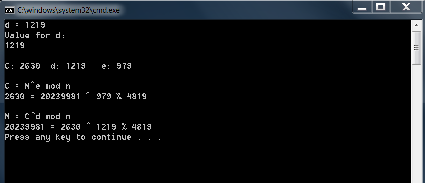

## RSA Encryption System  
### Description:

Network Security Final Project  

Given the M number: M20239981  
Using the last 3 digits: 981 as our value for e, the encryption key.  

--However, due to the bug mentioned in an email by the instructor, 981 is not relatively prime with the totient  
of n which is 4680, so 980 was tried but also failed. When subtracting one again from 980 to get 979, that turned  
out to be relatively prime with 4680, so that was used as the encryption key (e).  

Prime numbers above 50 used were 61 and 79.  
The prime numbers multiplied together equal 4819 as the value for n.  
To get the totient (φ(n)) : φ(n) = (p – 1)x(q – 1) = 4680.  
The value for the plaintext message was the M number: 20239981.  
Solving for the decryption key (d) I got the value 1219.  
After getting those values I verified that I was able to get the cyphertext (C) and then I was also able to get the  
original plaintext message (M) by decrypting the cyphertext with the decryption key.  
For C I got the answer 2630.  
For M I got the original message: 20239981.  

Output:  

 

### Files

|   #   | File                                    | Description                                                |
| :---: | --------------------------------------- | ---------------------------------------------------------- |
|   1   | [NetSecFinal.cpp](./NetSecFinal.cpp)    | Solution file                                              |

